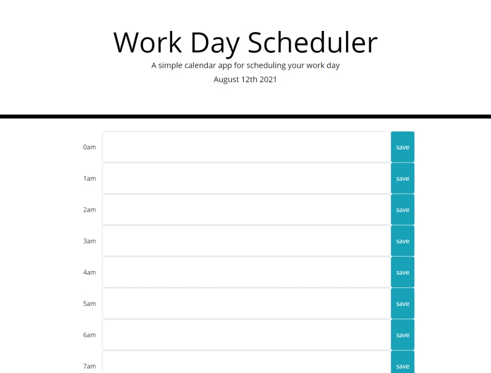

# Scheduler


## About The Project
This web application is a calendar application that allows a user to save events for each hour of the day. It does it by storing the data using localStorage. It also displays the current date on top using moment.js.
## Built With
This web application was built using HTML, JavaScript, and CSS for styling. The CSS was already given to me. But the rest I did myself.

## Installation

  Clone the repo
   ```sh
   git clone git@github.com:missile11011/scheduler.git
   ```

## Contact
Misael Reyes - misaelrey@gmail.com

Portfolio Link: [https://missile11011.github.io/scheduler/](https://missile11011.github.io/scheduler/)